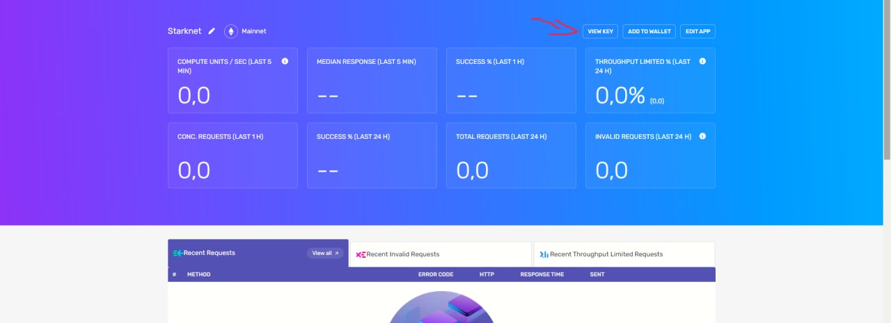
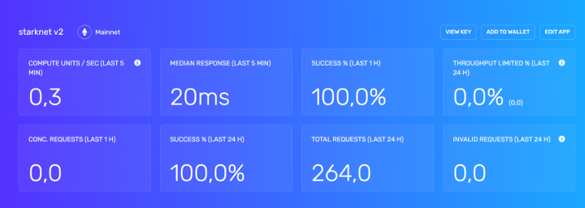
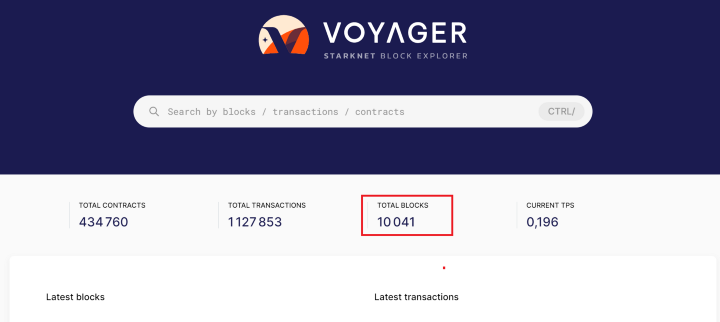
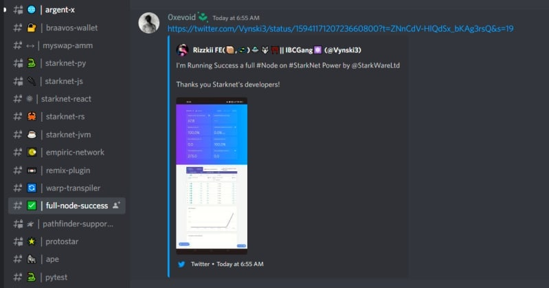

# Tutorial — How to install a node on the Starknet with Docker

We are going to attack again the node on starknet because my old tutorial has become obsolete. We don’t have any info on the rewards yet, but we do have a few days that would suggest that the token launch is not too far away. Because [**StarkNet’s ERC20 token contract is deployed on Ethereum**.](https://twitter.com/StarkWareLtd/status/1592897313273712640?s=20\&t=judEK08Ud7\_\_KUFNLiXThA)

I am passionate about the world of blockchain and I would like to share my passion and research with you through my articles in giving you my perception and opening new doors to very early crypto projects.

## <mark style="color:red;">Introduction to Starknet</mark> <a href="#257a" id="257a"></a>

<figure><figcaption><p>Their scaling solutions use STARK-based validity proofs to ensure an Ethereum-secure, fast and seamless user experience. They support a range of data availability modes.<br><br>StarkNet is a permissionless decentralized ZK-Rollup. It operates as an L2 network over Ethereum, enabling any dApp to achieve unlimited scale for its computation — without compromising Ethereum’s composability and security.<br><br>Using SHARP (SHARed Prover) technology, their solutions offer the same low marginal gas cost per transaction to all applications, regardless of their size.</p></figcaption></figure>

## Create an account on alchemy <a href="#425a" id="425a"></a>

The Starknet network is a Layer 2 of the Ethereum blockchain so it is essential that your Starknet node communicate with the Ethereum layer to work. For that I recommend you to create an Alchemy account to use their Layer 1 Ethereum API

Click [here](https://alchemy.com/?r=1398ad20311fea0e) to open an account on [Alchemy](https://alchemy.com/?r=1398ad20311fea0e) and followed all 11steps one by one below\
\- As usual, complete your account registration first\
\- Click Create APP\
\- Enter a name and description freely up to you\
\
\- Then Click show details\
\- Then Click show key\
\
\- Then copy your HTTPS link into Note\
\


## Preparation <a href="#b9d6" id="b9d6"></a>

* We then proceed to update the packages :

```
sudo apt update && sudo apt upgrade -y
```

* Wait for it to finish
* The required libraries are installed with the following command:

```
sudo apt install pkg-config curl git build-essential libssl-dev
```

> Press **Y** and then **ENTER** on your keyboard

*   Screen installation

    ```
    sudo apt install screen
    ```

> _When he asks you to press **Y** and then **ENTER** on your keyboard_

## Clone pathfinder github repository <a href="#ae83" id="ae83"></a>

* **Create a local copy** of github repository with this command:

```
git clone --branch v0.4.2 https://github.com/eqlabs/pathfinder.git
```

> If necessary replace **“v4.2”** _with newer version if that exists. You can check_ [_**here**_](https://github.com/eqlabs/pathfinder/tags)_**.**_

## Execute your node with docker <a href="#6eb5" id="6eb5"></a>

* Screen node

```
screen -S mynode
```

> And finally you can launch your node with the following command with the API created via Alchemy

```
mkdir -p $HOME/pathfinder
docker run \
  --rm \
  -p 9545:9545 \
  --user "$(id -u):$(id -g)" \
  -e RUST_LOG=info \
  -e PATHFINDER_ETHEREUM_API_URL="Your_HTTPS_Alchemy" \
  -v $HOME/pathfinder:/usr/share/pathfinder/data \
  eqlabs/pathfinder
```

> Below you will find a real example:
>
> ```
> mkdir -p $HOME/pathfinder
> docker run \
>   --rm \
>   -p 9545:9545 \
>   --user "$(id -u):$(id -g)" \
>   -e RUST_LOG=info \
>   -e PATHFINDER_ETHEREUM_API_URL="https://eth-mainnet.g.alchemy.com/v2/XxxxxxxxxxxxxxxxxxFK" \
>   -v $HOME/pathfinder:/usr/share/pathfinder/data \
>   eqlabs/pathfinder
> ```

&#x20;**Congratulation your node is running!**&#x20;

> Press CTRL+A+D\
> \
> &#x20;**Anytime you want to close the log!**&#x20;

## Check the progress of the synchronisation of your node <a href="#292d" id="292d"></a>

> Wait a moment (5 minutes) and go back to your Alchemy account dashboard

<figure><figcaption></figcaption></figure>

* To check the progress of the synchronization you can use the command below:

```
screen -r mynode
```

So you can see in the image above that your node is synchronising with the blockchain.\
For it to be fully synchronised it needs to scan all the blocks up to the last one.

To know the exact number of blocks already generated on starknet you can go directly [**here**](https://voyager.online/).

<figure><figcaption><p>Make sure you are on the Mainnet and not the Goerli<br>In my case there are 10k++blocks!<br> <strong>Congratulations your node is now with the starkware blockchain!!!!</strong> </p></figcaption></figure>

Tweet your screnshot and send on official [**dicord**](https://discord.gg/qypnmzkhbc) in “the full node success” section with the link to your tweet.

<figure><figcaption></figcaption></figure>

**✅ Done**
